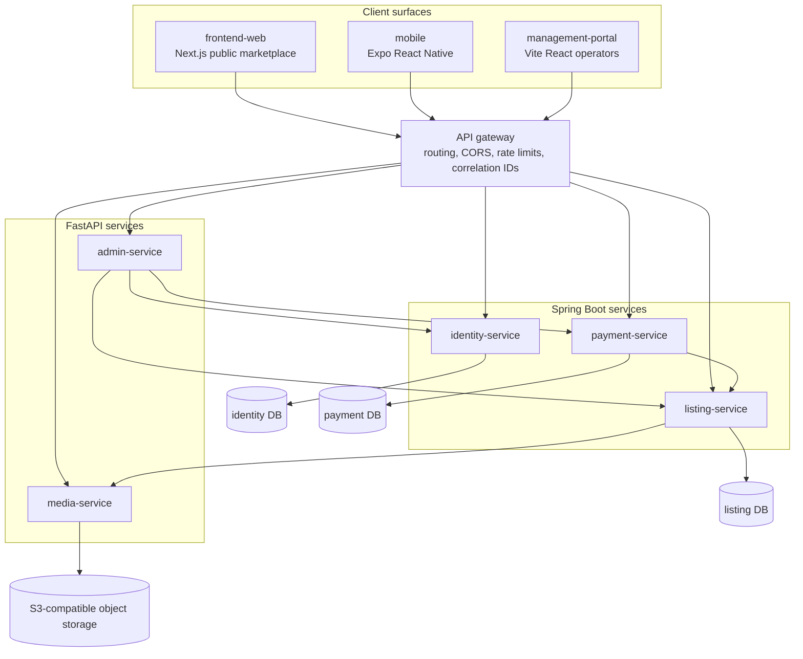

# LankaListings Architecture Blueprint

## Purpose

This document is the current architecture summary for the workspace at
`C:\Users\Malith Kavinda\Desktop\learning\advertising`.

It reconciles three sources of truth:

- The existing app scaffolds in this folder.
- The Stitch UI/UX exports in `stitch_advertising`.
- The later Codex discovery pack in `discovery` and
  `lankalistings-harness/.forge/discovery/docs`.

The important correction is that the project is not only a generic real estate
campaign tool in the current artifacts. The current Codex discovery work defines
**LankaListings as a Sri Lankan broad classified-advertising marketplace** with
real estate/property as one supported category. The user's longer-term business
goal of replacing real estate marketing-agency work should be treated as a
strategic vertical expansion on top of this classifieds platform, not as the
only MVP scope unless the product scope is changed.

## Current Project State

The workspace is not currently a git repository. `git status --short` fails at
the root with `fatal: not a git repository`, so there is no local git history or
uncommitted-change view available from this folder.

Top-level assets currently present:

- `stitch_advertising`: Google/Stitch UI export folder with public marketplace,
  mobile, account, ad-posting, search/detail, and admin/operator screens.
- `frontend-web`: Next.js public marketplace scaffold.
- `mobile`: Expo React Native scaffold.
- `management-portal`: Vite React management portal scaffold.
- `media-service`: FastAPI media/OCR service scaffold.
- `discovery`: index for reconstructed discovery documents.
- `lankalistings-harness`: Forge harness containing reconstructed product,
  architecture, data model, API, delivery, backlog, and decision documents.
- `node_modules`: dependency install output exists.
- `package-lock.json`: npm lockfile exists.
- `package.json`: root npm workspace manifest.
- `README.md`: workspace setup guide.
- `docs/architecture.md`: this document.

The root `package.json` defines three npm workspaces:

- `frontend-web`
- `management-portal`
- `mobile`

Current runtime/tooling evidence:

- `node` is available in this shell as Node v24.19.0.
- `npm` is not available in this shell, even though `node_modules` and
  `package-lock.json` exist from a prior install.
- `frontend-web/.next` exists, so the Next app has been built or run at least
  once.

Current app manifests:

- `frontend-web`: Next.js 14, React 18.2, React DOM 18.2, TypeScript, Tailwind,
  and `lucide-react`.
- `management-portal`: Vite 5, React 18.2, React DOM 18.2, TypeScript,
  Tailwind, and `lucide-react`.
- `mobile`: Expo SDK 51, React Native 0.74.7, React 18.2,
  `@expo/vector-icons`, `expo-status-bar`, and
  `react-native-safe-area-context`.

What is scaffolded:

- Public marketplace home screen in `frontend-web`.
- Admin dashboard starter UI in `management-portal`.
- Mobile marketplace home screen and listing card in `mobile`.
- FastAPI `media-service` with `/health` and `/api/v1/media/extract`.
- Consumer and operational visual directions are represented from the Stitch
  design exports.

What is still missing:

- No API gateway exists yet.
- No database schemas, migrations, or seed data exist yet.
- No shared OpenAPI/schema contract or generated API client exists yet.
- No real authentication, persistent media storage, moderation, publishing,
  lead capture, billing, or analytics implementation exists yet.
- No CI, Docker Compose/local stack, `.env.example`, test framework, or enforced
  linter is present in the three app workspaces.
- Native `android/` and `ios/` folders are not present; those should be created
  later through Expo prebuild if native project folders are needed.

Current `media-service` implementation notes:

- The service is located at top-level `media-service`, matching the discovery
  service name because no `backend` folder existed when it was created.
- It uses FastAPI with the shared `{ data, error }` envelope style and
  correlation ids on structured errors.
- It accepts uploaded images at `POST /api/v1/media/extract`, validates upload
  presence, size, and content type, records local JSON media asset metadata, and
  calls a local OCR engine boundary.
- It exposes `GET /api/v1/media/extractions/{extraction_id}` to retrieve a
  previous extraction result while the local metadata store remains in place.
- Local OCR uses `pytesseract` when the Python package and the Tesseract binary
  are both available. On the current machine, the Python dependencies install,
  but the Tesseract executable is not on `PATH`, so the service returns a
  structured `OCR_UNAVAILABLE` response instead of claiming extraction worked.
- The JSON-backed `MediaAsset` and `ExtractionResult` records are temporary and
  should migrate to the `media_assets`, `media_derivatives`, `extraction_jobs`,
  and `extracted_fields` tables when the data layer is introduced.

## Locked MVP Decisions From Discovery

The Forge discovery pack records these as current MVP decisions:

- Marketplace model: any user may create an advertisement.
- Categories: broad classifieds, including vehicles, property, land, jobs,
  electronics, services, home and garden, fashion, and other.
- Publication: an advertisement is public only after admin approval.
- Revenue: standard publication is free; sellers pay only to feature an approved
  ad.
- Authentication: Google OAuth plus email/password accounts.
- Market: Sri Lanka.
- Currency: LKR.
- Location hierarchy: Province -> District -> City.
- Initial UI language: English.
- Public marketplace client: Next.js.
- Management portal client: Vite React.
- Mobile app: Expo React Native for Android and iOS.
- Backend style: microservices.
- Backend runtimes: both Spring Boot and FastAPI.
- FastAPI serves the management portal CRUD/BFF surface.

## Strategic Product Direction

The current MVP should remain a classifieds marketplace unless the product scope
is explicitly changed. However, the architecture should leave room for the
real-estate advertising goal:

> Help property owners, agents, and developers perform much of the work normally
> handled by real estate marketing agencies: listing setup, media management,
> ad-package selection, promotion, lead capture, and performance tracking.

For MVP, this means property/real-estate must fit cleanly into the generic ad
model through category-specific attributes. Later, property can become a richer
vertical with campaign recommendations, project pages, lead pipelines, and
creative generation.

## User Roles

- Member: can browse, save ads, create ads, submit ads for review, and pay to
  feature approved ads.
- Seller: same account type as a member, with selling activity and optional
  verification state.
- Buyer/renter: browses listings, saves listings, and submits inquiries.
- Moderator: reviews pending ads, approves or rejects ads, and handles reports.
- Super admin: manages users, taxonomy, promotion plans, settings, and operator
  permissions.
- Support/operations: resolves account, payment, listing, campaign, and
  lead-delivery issues.
- Agent, later real estate vertical: manages many property listings and leads.
- Developer/team, later real estate vertical: manages projects, units, brand
  assets, approvals, and campaign budgets.

## Recommended Service Architecture

The current discovery pack locks microservices with Spring Boot and FastAPI.
That is more complex than a modular monolith, but the architecture should follow
the locked decision unless the user intentionally revises it.

### Spring Boot Transactional Core

- `identity-service`: accounts, credentials, Google OAuth account linking, email
  verification, password reset, JWT issuance/refresh, roles, and seller
  verification.
- `listing-service`: advertisement aggregate, ad status machine, category
  taxonomy, category-specific attribute definitions, Sri Lankan location
  hierarchy, public search/browse/detail endpoints, moderation decisions,
  favourites, reports, and view/inquiry counters.
- `payment-service`: promotion plan catalogue, featured-ad purchases, payment
  gateway integration, webhook settlement, receipts, and featured-window
  lifecycle.

### FastAPI Python Services

- `admin-service`: management portal BFF and CRUD surface, moderation queue
  projection, advertisement register, user administration, category/attribute
  management, promotion plan administration, dashboard KPIs, and reports.
- `media-service`: image upload, validation, derivative generation,
  object-storage lifecycle, duplicate-image support through checksums, and
  optional OCR/AI extraction.

### API Gateway

All clients should call through an API gateway responsible for routing, TLS,
CORS, rate limiting, correlation ID propagation, and basic request logging.

The gateway may validate tokens, but each service must still enforce its own
authorization rules.

## Service Ownership Rules

- `listing-service` is the only service that can change ad status.
- `admin-service` may request approval/rejection transitions, but must not write
  listing status directly.
- Public listing reads must return only `active` ads.
- Non-active ads fetched by non-owners should return not found, not forbidden,
  to avoid leaking moderation state.
- Cross-service references should use opaque IDs, not database foreign keys.
- Payment settlement must be idempotent using the payment gateway reference.
- Money must be stored and transferred as integer LKR minor units.

## High-Level Architecture



## Core Workflow

1. User creates an account using email/password or Google OAuth.
2. User creates an advertisement draft.
3. User selects category and enters category-specific attributes.
4. User uploads photos.
5. Media service validates images and creates derivatives.
6. User submits the ad for review.
7. Moderator reviews the ad in the management portal.
8. Listing service transitions approved ads to `active`.
9. Public web and mobile clients show only active ads.
10. Buyer/renter submits an inquiry or saves an ad.
11. Seller views ad performance and inquiries.
12. Seller can pay to feature an already approved active ad.
13. Payment service settles the payment and starts the featured window.
14. Analytics and reports feed seller and admin dashboards.

## MVP Modules

1. Identity and accounts.
2. Category and location reference data.
3. Advertisement creation and draft management.
4. Media upload and image derivatives.
5. Admin moderation.
6. Public marketplace search and detail pages.
7. Favourites and inquiries.
8. Featured-ad payment flow.
9. Admin dashboard and operational reports.
10. Basic analytics and observability.

## Data Model

Initial entities by owning service:

- `identity-service`: `accounts`, `credentials`, `oauth_identities`, `roles`,
  `seller_verifications`, `refresh_tokens`.
- `listing-service`: `advertisements`, `advertisement_attributes`,
  `categories`, `category_attribute_definitions`, `provinces`, `districts`,
  `cities`, `moderation_decisions`, `ad_reports`, `favourites`, `ad_metrics`.
- `media-service`: `media_assets`, `media_derivatives`, optional
  `extraction_jobs`, optional `extracted_fields`.
- `payment-service`: `promotion_plans`, `featuring_purchases`,
  `payment_transactions`.
- `admin-service`: no core business state in MVP; it primarily composes and
  projects data from other services.

## API Boundary Summary

All gateway paths should be versioned from the beginning because the mobile app
cannot be upgraded in lockstep with every backend deployment.

Recommended path prefix:

```text
/api/v1
```

Core API groups:

- `/auth`: register, login, Google OAuth exchange, refresh, logout,
  verification, password reset.
- `/me`: current profile, phone verification, seller profile.
- `/categories`: taxonomy tree and attribute definitions.
- `/locations`: provinces, districts, and cities.
- `/ads`: public search/detail plus seller ad creation and management.
- `/media`: upload, delete, derivative access, optional extraction.
- `/promotion-plans`: public featured-ad package catalogue.
- `/payments` or `/ads/{reference}/featuring`: paid featuring purchase flow.
- `/webhooks/payments/{gateway}`: payment settlement callbacks.
- `/admin`: dashboard KPIs, moderation, user administration, ad register,
  category management, promotion plan management, reports, settings.

API conventions:

- Use a consistent response envelope across all services.
- Use lower snake case enum values on the wire.
- Use cursor pagination for public listing collections.
- Permit offset pagination for admin/operator tables.
- Use RFC 3339 UTC timestamps.
- Return structured validation errors with field-level details.
- Include a correlation ID in errors and logs.

## Background Jobs

Required or likely jobs:

- Image derivative generation.
- Media validation and optional virus scanning.
- Duplicate-image detection.
- Payment webhook reconciliation.
- Featured-window activation and expiry.
- Notification dispatch for verification, rejection, approval, inquiries, and
  receipts.
- Analytics event aggregation.
- Report/moderation queue assistance.
- Optional OCR/AI field extraction.

## Implementation Phases

### Phase 0: Scope Confirmation

Resolve whether the MVP remains broad classifieds or pivots to real-estate-only.
The current artifacts say broad classifieds. The user's strategic direction says
real estate advertising agency replacement. Both can coexist, but they imply
different first slices.

### Phase 1: Foundation

- Initialize git if this folder should become the working repository.
- Decide exact backend repo/service layout.
- Add API gateway skeleton.
- Add one Spring Boot service skeleton and one FastAPI service skeleton.
- Add local Docker Compose for PostgreSQL, Redis, and object-storage emulator if
  local one-command boot is required.
- Add `.env.example` files.
- Add CI or local verification scripts.

### Phase 2: Identity and Reference Data

- Implement accounts, credentials, Google OAuth, roles, and sessions.
- Seed Sri Lankan Province -> District -> City data.
- Seed the nine top-level categories.
- Define category-specific attributes for Vehicles and at least Property.

### Phase 3: Ad Creation and Moderation

- Implement ad draft CRUD.
- Implement category attributes.
- Implement media upload attachment.
- Implement submit-for-review.
- Implement admin moderation queue.
- Enforce that only active ads are public.

### Phase 4: Public Discovery

- Replace hard-coded fixtures in `frontend-web` and `mobile` with API clients.
- Implement public search, filtering, sorting, and ad detail.
- Add favourites and basic inquiry capture.

### Phase 5: Featured Ads and Payments

- Implement promotion plans.
- Integrate the selected Sri Lanka-compatible payment provider.
- Settle webhooks idempotently.
- Start and expire featured windows.
- Reflect featured status in search ranking.

### Phase 6: Management Portal Completion

- Replace portal mock data with admin API calls.
- Add user administration.
- Add category and promotion-plan administration.
- Add reports and settings once their scope is defined.

### Phase 7: Real Estate Advertising Expansion

If the product goal is to replace real estate marketing agency work, add this
after the core ad platform is stable:

- Property-specific listing schemas.
- Agent/developer profiles.
- Project pages and unit inventory.
- Campaign builder for property promotions.
- AI-generated property ad copy.
- Social/email/WhatsApp campaign packages.
- Lead pipeline and follow-up reminders.
- Performance dashboard for campaigns and leads.
- Creative variants and A/B testing.

## High-Risk Areas

- Microservice foundation cost before visible product progress.
- Spring Boot and FastAPI auth consistency.
- Admin service accidentally becoming a second source of truth.
- Moderation enforcement across every public read path.
- Payment idempotency and featured-window correctness.
- Category-specific attribute modelling.
- Search/filter performance across dynamic attributes.
- Media storage, derivative generation, and CDN strategy.
- Mobile release pipeline and API versioning.

## Current Contradictions Resolved

This document replaces the earlier generic architecture proposal with the
architecture already implied by Codex discovery work.

- Earlier proposal: modular monolith.
  Current corrected direction: microservices, because the discovery pack records
  that as a locked MVP decision.
- Earlier proposal: backend framework undecided, with NestJS/Fastify/Go as
  options.
  Current corrected direction: Spring Boot plus FastAPI, with FastAPI serving
  the management portal CRUD/BFF surface.
- Earlier proposal: real-estate advertising platform as the whole product.
  Current corrected direction: broad Sri Lankan classifieds MVP, with real
  estate advertising-agency replacement as a strategic vertical expansion unless
  the user changes MVP scope.
- Earlier status: dependencies were not installed.
  Current corrected status: `node_modules` and `package-lock.json` exist, and
  `frontend-web/.next` exists, but `npm` is not currently available in this
  shell, so dependency verification cannot be completed here.

## Open Decisions

Product decisions:

- Is the MVP still broad classifieds, or should it pivot to real-estate-only?
- Is in-app messaging in MVP scope?
- Is OCR/AI ad intake in MVP scope?
- Which post-ad stepper design is authoritative?
- What are the attribute schemas for non-vehicle categories?
- Which payment gateway should be used for LKR payments?
- What are the featured promotion plans, prices, and durations?
- How long does an ad stay live before expiry?
- What earns the Verified Seller badge?
- Is the 24-hour moderation promise an SLA or only a target?
- Is seller phone number visibility public or gated behind sign-in?
- What is the featured-vs-organic ranking rule?

Architecture decisions:

- Confirm the five-service split.
- Confirm whether `admin-service` may read listing data directly for operator
  projections, or must compose only through APIs.
- Choose database-per-service setup and migration tools.
- Choose object storage and CDN.
- Choose queue/event transport.
- Choose notification provider.
- Choose observability stack.
- Choose deployment target and CI/CD platform.
- Define mobile build/release workflow.
- Define data retention and deletion policy.

## Source Documents To Keep In Sync

- `discovery/README.md`
- `lankalistings-harness/.forge/discovery/docs/01-product-requirements.md`
- `lankalistings-harness/.forge/discovery/docs/02-ux-scope.md`
- `lankalistings-harness/.forge/discovery/docs/03-architecture.md`
- `lankalistings-harness/.forge/discovery/docs/04-data-model.md`
- `lankalistings-harness/.forge/discovery/docs/05-api-contract.md`
- `lankalistings-harness/.forge/discovery/docs/06-delivery-quality.md`
- `lankalistings-harness/.forge/discovery/docs/07-harness-backlog.md`
- `lankalistings-harness/.forge/discovery/docs/08-decision-log.md`
