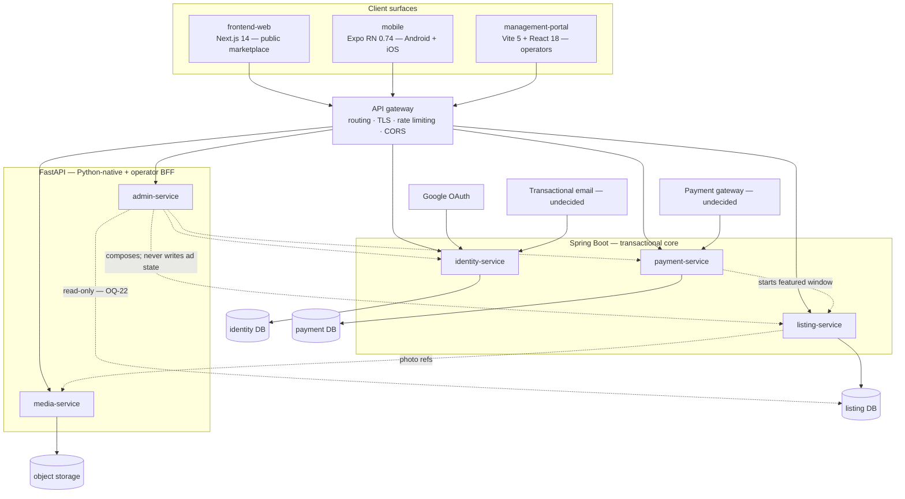

# LankaListings — System Architecture

> Status: draft — **awaiting Gate 2 (`/forge-arch-probe`)**
> Last updated: 2026-08-24
> Related: `.forge/project-prd.md`, `.claude/CLAUDE.md`, `.forge/discovery/docs/03-architecture.md`
>
> **Everything below except §Locked Constraints is `[PROPOSED]`.** The five-service split, the language
> boundary, the database choice, and the deployment shape are proposals for Gate 2 to confirm or replace.
> Do not treat any of it as settled, and do not promote a row into CLAUDE.md's decision table until its
> gate confirms it. Long-form reasoning and the rejected alternatives are in
> `.forge/discovery/docs/03-architecture.md`.

## Overview

LankaListings is a moderated classifieds marketplace: sellers create structured, category-aware listings;
every listing passes human review before becoming publicly visible; approved listings are discoverable by
category, location, price and category-specific attributes; and sellers can pay to feature an approved
listing for a bounded window.

Technically it is **three client surfaces over a polyglot microservice backend**. The backend does not
exist yet — five services and a gateway, all greenfield. The clients exist as booting skeletons rendering
hard-coded fixtures.

The architecture's central obligation is a single invariant: **a non-`active` advertisement must be
invisible on every public read path.** That is the product's core promise, it spans four read routes and
three clients, and one unguarded path breaks it silently.

## Locked Constraints

| Constraint | Source |
|---|---|
| Public marketplace on Next.js; management portal on Vite + React; mobile app on Expo React Native (Android + iOS) — all three in MVP scope | Product owner |
| The backend is **microservices**, using **both Spring Boot and FastAPI** | Product owner |
| **FastAPI serves the management portal's CRUD surface** | Product owner |
| An ad is public only after admin approval — enforced server-side, never in the UI | Original pack |
| LKR only; Province → District → City | Original pack |
| Payment capture is not built before an approvable ad exists | Original pack |

## System Context

## Components

| Component | Responsibility | Stack | Repo |
|-----------|---------------|-------|------|
| **API gateway** | Routing, TLS termination, CORS, rate limiting, JWT signature pre-check | Undecided (OQ-28) | Not created |
| **identity-service** | Accounts, email/password credentials, Google OAuth exchange, **account linking**, email verification, password reset, JWT issue/refresh, roles, seller verification | Spring Boot | Not created |
| **listing-service** | The Advertisement aggregate and its **entire status machine**, category taxonomy, attribute definitions, location hierarchy, photo references, moderation decisions, public search/browse reads, metrics | Spring Boot | Not created |
| **payment-service** | Promotion plan catalogue, featuring purchases, gateway integration, idempotent webhook settlement, receipts, featured-window lifecycle | Spring Boot | Not created |
| **admin-service** | Management-portal CRUD/BFF: moderation queue projection, advertisements register, CSV export, user/category/plan administration, dashboard KPIs, reports, settings | FastAPI | Not created |
| **media-service** | Image upload, validation, derivative generation, object-storage lifecycle, content checksums; OCR/AI field extraction **if OQ-02 goes in scope** | FastAPI | Not created |
| **frontend-web** | Public responsive marketplace | Next.js 14.2, React 18.2, TS 5.4, Tailwind 3.4 | `../frontend-web` |
| **management-portal** | Operator console, desktop-first | Vite 5.3, React 18.2, TS 5.4, Tailwind 3.4 | `../management-portal` |
| **mobile** | Native app, both platforms | Expo ~51, RN 0.74.7, TS 5.4 | `../mobile` |

**Why the language boundary falls where it does:** Python owns image and machine-learning work plus the
operator CRUD surface; the JVM owns the transactional marketplace core. That way "why is this in Python?"
has the same answer every time, rather than being a per-service taste call.

**Two structural rules that are not negotiable within this proposal:**

1. **`listing-service` alone owns ad state transitions.** `admin-service` *requests* an approval; it never
   writes the status. Two code paths that can approve an ad defeats the moderation gate entirely.
2. **`admin-service`'s direct listing-store access is read-only and enforced at the database-credential
   level**, not by convention — pending OQ-22. If Gate 2 rejects the exception, `admin-service` becomes a
   pure HTTP composer and `listing-service` grows operator-facing query endpoints.

## Data Flow

**Public read** (the busiest path in the product): client → gateway → `listing-service` →
`GET /ads` with filter, sort and cursor parameters. Every consumer discovery surface across three clients
funnels through this one endpoint. It filters `status = active` before anything else, applies
featured-first ordering **server-side** within the requested sort, and returns a `meta.total` because the
UI renders a result count.

**Ad submission:** client → `listing-service` (`draft`, then incremental `PATCH` per wizard step) with
photos going client → `media-service` in parallel; `POST /submit` transitions `draft → pending`.

**Moderation:** portal → `admin-service` (queue projection, oldest-first) → moderator opens an ad →
approve/reject delegated to `listing-service`, which performs the transition and records an append-only
`ModerationDecision`.

**Featuring:** client → `payment-service` → verifies with `listing-service` that the ad is `active` and
owned by the caller → checkout at the gateway → settlement arrives by webhook, signature-verified and
**idempotent on the gateway reference** → `payment-service` asks `listing-service` to start the featured
window. The window starts on settlement only.

Detailed entity and index modelling: `.forge/discovery/docs/04-data-model.md`. API conventions and the
full resource surface: `.forge/discovery/docs/05-api-contract.md`.

## Deployment Topology

`[PROPOSED]` — wholly undecided (OQ-28), a Gate-2 output.

| Environment | Purpose |
|---|---|
| **Local** | Whole stack bootable by **one command**. Non-negotiable: five services plus three clients plus Postgres plus object storage cannot be hand-started daily by every developer |
| **Staging** | Full stack, payment-gateway sandbox, seeded deterministic dataset |
| **Production** | Sri Lanka-proximate region for latency |

Open: container orchestration, managed vs self-hosted Postgres, object storage provider, CDN for ad
imagery, CI/CD platform.

## Cross-Cutting Concerns

- **Authentication** — `identity-service` issues short-lived JWT access tokens plus refresh tokens. The
  gateway checks signature and expiry; **every service enforces authorisation independently**, because
  gateway-only enforcement leaves any network-reachable service unprotected. Mobile uses the platform
  secure store, never AsyncStorage.
- **Authorisation** — three separate questions: is this ad publicly readable (`active` only); does this
  member own this ad (every seller mutation and featuring purchase); is this operator permitted (role
  checked in-service).
- **Moderation enforcement** — implemented at a single repository/query layer in `listing-service` that no
  read path can bypass, with a test per public route asserting non-`active` invisibility. A hidden ad
  returns **404, not 403** — a 403 confirms existence and leaks the queue.
- **API conventions, binding on all five services** — one envelope (`data` / `error` / `meta`), one error
  contract keyed on a stable `error.code`, lower-snake_case enums on the wire, RFC 3339 UTC timestamps,
  cursor pagination on public collections. **Where a framework default conflicts, the framework loses** —
  FastAPI's default `422` body and `{"detail": …}` error shape are both overridden.
- **Money** — integer LKR minor units end to end, with an explicit currency. No floating point in any of
  five services or three clients. Formatting (`Rs. 8,750,000`) is a client concern.
- **Idempotency** — payment webhooks keyed on a unique gateway reference. Settlements are redelivered in
  practice, not in theory.
- **Versioning** — `/api/v1` from the first commit. The reason is mobile: an installed app version cannot
  be force-updated in step with a server deploy. This is the one architectural cost of mobile-in-MVP that
  is easy to forget until it is expensive.
- **Observability** — structured JSON logs on one schema across both runtimes, with a correlation id
  propagated gateway → service → service and returned to clients in `error.correlation_id`. Without
  correlation, a five-service polyglot backend is not debuggable — which turns R-1 from a cost risk into a
  delivery risk. No PII in log output.
- **Configuration** — environment variables only, no secrets in any repo, an `.env.example` per service and
  per client, and startup validation that required variables are present. The three clients currently have
  no `.env.example` at all.
- **Design systems** — two token sets, never merged. Consumer serves `frontend-web` + `mobile`; operational
  serves `management-portal`. They assign **different values to the same token names**, so a shared file
  would silently corrupt both.

## Build Feasibility & High-Risk Requirements

| Requirement | Why high-risk | Paper sketch / Spike |
|-------------|---------------|----------------------|
| **Polyglot microservice foundation** | The largest single cost in the plan, and all of it lands before the first user-visible feature: per-service CI/CD, gateway, distributed auth, cross-service transaction reasoning, correlated observability, whole-stack local boot | **SPIKE (time-boxed).** Stand up two trivial services — one per runtime — behind the gateway with shared JWT validation, correlated logging, and one-command local boot. This either de-risks the whole shape or triggers the documented fallback to two deployables (one Spring Boot modular monolith + one FastAPI service). Runs as F-002, before feature work |
| **Moderation invisibility across every read path** | A single unguarded path silently breaks the product's core promise, across four routes and three clients | **Sketch.** Single enforcement point in the repository/query layer; a per-route test asserting non-`active` invisibility; 404-not-403 for hidden ads |
| **Payment settlement correctness** | Double-charging, or paid-but-not-featured, is a trust and refund event. The worst failure mode is invisible unless reconciliation is built deliberately | **Sketch.** Idempotent webhook on a unique gateway reference; featured window started only from a settled payment; reconciliation view plus an operator alert |
| **Category attribute schemas** | Nine categories, one specified. The mechanism drives ad creation, ad detail, search filters, and admin taxonomy — four surfaces at once | **SPIKE.** Design the mechanism (dynamic definitions vs per-category typed models) against Vehicles plus two structurally different categories **before Gate 3** |
| **Search and filter performance** | Multi-facet filtering with featured-first ranking over a growing corpus; the dynamic-attribute model turns multi-attribute filters into intersected index lookups | **Sketch.** Index plan per data-model §7, including partial indexes on `status = 'active'`; measure at planning volumes |
| **Mobile release pipeline** | Two app stores, review latency, native build infrastructure — a delivery path the web surfaces do not have | **Sketch.** EAS build/submit, versioning, OTA-vs-store-update policy |
| **AI/OCR extraction** (conditional on OQ-02) | Accuracy targets, per-field confidence, review UX, model cost, and a whole ingestion path | **SPIKE if scoped in.** Otherwise record as deferred, retaining the review UI's provenance model |

## In-House-First Audit

| External dependency | In-house alternative considered | Rationale for external choice |
|---------------------|----------------------------------|-------------------------------|
| Google OAuth | Own credentials only | Locked requirement — federated sign-in is a product decision |
| Payment gateway | None viable | Card acquiring is not buildable; LKR settlement narrows the field further |
| Object storage + CDN | Local disk + application-served images | Image-bandwidth-dominated product; durability and egress economics |
| Transactional email | Own SMTP | Deliverability is an operational discipline, not a feature |
| Managed PostgreSQL | Self-hosted | Backup/restore and failover cost versus operational capacity |
| OCR / vision model | Own model | Only if OQ-02 scopes extraction in; training a model is out of scope regardless |
| Framework/runtime choices (Next.js, Vite, Expo, Spring Boot, FastAPI) | — | Locked |

## Resource & Timeline Reality

- **Team capacity vs. PRD scope:** **UNKNOWN — no team size exists in any input (OQ-20).** This section
  cannot be completed, and Gate 2 should not pass without it. Nine scope rows across five greenfield
  services and three clients, plus ~11 undesigned surfaces, is a substantial programme by any staffing
  assumption.
- **Skills gaps:** the shape requires Spring Boot **and** FastAPI **and** Next.js **and** Vite/React **and**
  React Native competence, plus infrastructure capability for a five-service polyglot deployment. Whether
  the team has all of it is unknown.
- **Critical-path estimate vs. delivery window:** **UNKNOWN — no delivery window exists in any input
  (OQ-20).** The critical path is foundation → accounts → creation+moderation → discovery → featuring;
  foundation alone is 13 substrate slices.

## Key Technical Decisions

See `.claude/CLAUDE.md` → "Architecture Decisions (DO NOT REVERSE)" for the authoritative locked list.
The 16 `[PROPOSED]` engineering decisions awaiting Gate 1/2 confirmation, with their rationale and the
rejected alternatives, are in `.forge/discovery/docs/08-decision-log.md` Part A.

## Foundation Backlog

Substrate that must exist before per-feature work. The tooling-versus-instance rule holds: *migration
tooling configured* is foundation; *the ads table migration* is a feature. Detail and definitions of done
are in `.forge/discovery/docs/07-harness-backlog.md`.

| # | Slice | What it produces (substrate, not instances) | Repo |
|---|-------|---------------------------------------------|------|
| F-001 | Repository and workspace shape | Git initialised (**`advertising/` is currently not a repository**), service repo layout, branch/PR conventions, `.env.example` per repo | all |
| F-002 | Gateway + two service skeletons | One Spring Boot and one FastAPI service with health endpoints, reachable through the gateway with routing, TLS, CORS, rate limiting. **This is the R-1 spike made permanent** | gateway + 2 services |
| F-003 | Shared auth substrate | JWT issuance; independent validation working in **both** runtimes; role model; a documented per-service pattern. No user-facing auth yet | identity + both runtimes |
| F-004 | Data layer scaffolding | Postgres per service; migration tooling in both runtimes; repository/session pattern. **No entity migrations** | all services |
| F-005 | Object storage + image pipeline | Upload works; derivative pipeline exists with no ad coupling | media-service |
| F-006 | Consumer design-system primitives | Full consumer token set as one source of truth (replacing the current lossy partial translation); Button, Input, Card, Chip, price formatter, skeleton loader — shared web + native; icon set standardised | frontend-web, mobile |
| F-007 | Operator design-system primitives | Operational token set as a **separate** file; DataTable (sticky header, 48px rows, hover striping, inline actions), MetricCard, StatusChip, BulkActionToolbar, collapsible sidebar, `Cmd+K` search | management-portal |
| F-008 | Build & CI | **A real linter** (today `lint` is aliased to `tsc --noEmit`), typecheck, test, build green per repo; dependency-vulnerability gate at a chosen CVSS threshold | all |
| F-009 | Observability substrate | Structured JSON logging on one schema in both runtimes; correlation-id propagation returned on error; client error reporting with release tagging; PII exclusion | all |
| F-010 | Local stack orchestration | **One command boots everything** — five services, three clients, Postgres, object storage | all |
| F-011 | Test harness + seed dataset | Every tier runnable in every repo; the deterministic seed dataset loads | all |
| F-012 | Reference data | Provinces, districts, cities; nine top-level categories with subcategories; Vehicles attribute definitions | listing-service |
| F-013 | Developer onramp | Per-repo README; "how to add a feature"; the seam-contract workflow documented | all |

**F-002 gates everything.** If it overruns its time box, the two-deployable fallback triggers *before*
feature work starts, not after.

## Links to Repo-Level Design Docs

Not yet created — the backend repos do not exist and the client repos have no `CLAUDE.md`.

- Data model: `<listing-service>/docs/data-model.md` — interim source: `.forge/discovery/docs/04-data-model.md`
- API contracts: OpenAPI per service — interim source: `.forge/discovery/docs/05-api-contract.md`
- Style spec: consumer and operator `DESIGN.md` under `../stitch_advertising/` — interim source of truth
- Per-repo stack profiles: the `## Backend Stack` / `## Frontend Stack` sections that the wave-mode
  implementer agents read on turn 1 are **not yet authored** in any repo

## Open Questions

Tracked live in `.forge/project-prd-signals.md` — 13 architecture questions (OQ-21…OQ-33) plus the
product questions that constrain architecture. The four that most shape this document:

- **OQ-21** — confirm or reject the five-service split and the language boundary
- **OQ-22** — accept or reject `admin-service`'s read-only direct listing-store access
- **OQ-30** — dynamic attribute definitions or per-category typed models
- **OQ-20** — team size and delivery window, without which §Resource & Timeline Reality cannot be completed
