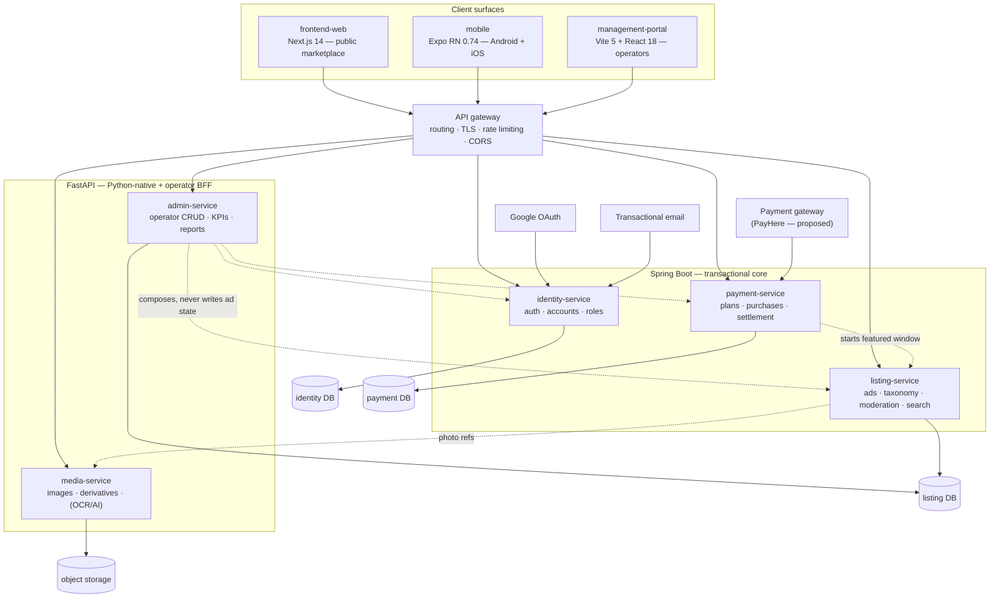

# 03 — Architecture

> Reconstructed 2026-08-24. Provenance tags per `README.md`.
> Downstream: this document is the primary input to `.forge/design/architecture.md`, which Gate 2
> (`/forge-arch-probe`) verifies. **Nothing in §3 is locked yet — the service split is a proposal.**

## 1. Locked constraints

| Constraint | Source |
|---|---|
| Public marketplace is Next.js; management portal is Vite + React; the API layer includes FastAPI | Original pack index `[LOCKED]` |
| A mobile app (Expo React Native, Android + iOS) is an MVP surface | 2026-08-24 scoping `[LOCKED]` |
| The backend is **microservices**, using **both Spring Boot and FastAPI** | 2026-08-24 scoping `[LOCKED]` |
| FastAPI serves the management portal's CRUD surface | 2026-08-24 scoping `[LOCKED]` |
| Ads are public only after approval — enforcement is server-side, not a UI concern | Original pack index `[LOCKED]` |
| LKR only; Province → District → City | Original pack index `[LOCKED]` |

## 2. The feasibility concern, stated once

A polyglot microservice backend across two JVM/Python runtimes, serving three client surfaces, is a
**high-infrastructure-cost shape for an MVP with no backend code written yet.** Before any feature work
it requires: per-service repo/CI/CD, service discovery, an API gateway, distributed auth token
validation, cross-service transaction reasoning, per-service database provisioning, correlated logging
and tracing, and a local development story that boots the whole stack.

That cost is real and it lands entirely in the foundation phase, before the first user-visible feature.
This is recorded as a **risk with a named mitigation**, not as an objection — the decision is made and
the architecture below implements it:

> **R-ARCH-01.** Polyglot microservices at MVP multiplies foundation cost and slows first delivery.
> **Mitigation:** keep the service count minimal (five, §3), make the language split follow a real
> capability boundary rather than a taste boundary, and treat the gateway + auth + observability +
> local-stack story as explicit foundation slices with their own specs — so the cost is visible and
> scheduled instead of discovered. Re-examine service granularity at the first post-MVP retrospective.

A second, cheaper shape exists and should be recorded as the rejected alternative so the decision is
traceable: two deployable services (one Spring Boot modular monolith + one FastAPI service), splitting
into finer services only when a scaling or team boundary demands it. `[PROPOSED]` as the Gate-2
fallback if foundation cost overruns.

## 3. Proposed service split `[PROPOSED]`

The language boundary follows capability, so that "why is this in Python?" always has the same answer:
**Python owns image and machine-learning work plus the operator CRUD surface; the JVM owns the
transactional marketplace core.**

### Spring Boot — transactional core

| Service | Owns | Why JVM |
|---|---|---|
| **identity-service** | Accounts, email/password credentials, Google OAuth exchange, email verification, password reset, JWT issuance and refresh, roles, seller verification state | Security-critical, transactional, mature OAuth/JWT ecosystem |
| **listing-service** | The Advertisement aggregate and its full status machine (§5 of doc 01), category taxonomy, per-category attribute schemas, location hierarchy, photo references, moderation decisions, public search/browse read endpoints, view and inquiry counters | The core domain and the only place ad state may transition; strong typing and transaction semantics matter most here |
| **payment-service** | Promotion plan catalogue, featuring purchases, gateway integration, webhook settlement handling, receipts, the featured-window lifecycle | Money. Isolated so a gateway change or a settlement bug cannot corrupt listing state; needs exact-integer money handling and idempotent webhook processing |

### FastAPI — Python-native work and the operator surface

| Service | Owns | Why Python |
|---|---|---|
| **admin-service** | The management portal's CRUD/BFF surface: moderation queue projection, advertisements register with filters and CSV export, user administration, category and attribute-schema administration, promotion plan administration, dashboard KPI aggregation, reports, settings | Explicitly locked to FastAPI by the product owner. As a BFF it composes calls to the core services and shapes them for the operator tables |
| **media-service** | Image upload, validation, derivative generation (thumbnail / card / gallery / main), object-storage lifecycle, and — if FR-34 is scoped in — OCR and AI field extraction with per-field confidence | Image pipelines and OCR/ML are Python's home ground. This is the clearest technical justification for FastAPI being in the stack at all |

**Notes on the split:**

- **Search stays inside `listing-service` at MVP** as read endpoints over the primary store. A separate
  search service or read model is deferred until measured query latency justifies it — introducing one
  now adds an eventual-consistency bug class to the most visible surface in the product. `[PROPOSED]`
- **`admin-service` is a BFF, not a second source of truth.** It must never write ad state directly; an
  approve/reject action calls `listing-service`, which owns the transition. Violating this creates two
  code paths that can approve an ad — the exact failure the moderation gate exists to prevent.
- **Notifications** (verification email, rejection notice, featuring receipt) are unassigned. Options:
  a sixth service, or a shared library used by whichever service owns the triggering event. `[PROPOSED]`
  — a library plus one queue, not a service, at MVP.

## 4. Context diagram

## 5. Client surfaces — as committed today

Read off the skeletons. `[DERIVED]`

| Surface | Stack | State today |
|---|---|---|
| `frontend-web` | Next.js 14.2 (App Router), React 18.2, TypeScript 5.4, Tailwind 3.4, `lucide-react` | Boots. One page (`src/app/page.tsx`) rendering hard-coded categories and featured listings from `src/lib/listings.ts`. Partial consumer token translation in `tailwind.config.ts`. `lint` is aliased to `tsc --noEmit` — **there is no actual linter wired** despite `eslint` + `eslint-config-next` being in devDependencies |
| `management-portal` | Vite 5.3, React 18.2, TypeScript 5.4, Tailwind 3.4, `lucide-react` | Boots. Single `App.tsx` rendering mock metrics and a review queue from `src/lib/data.ts`. Same `lint` = `tsc --noEmit` aliasing |
| `mobile` | Expo ~51, React Native 0.74.7, React 18.2, TypeScript 5.4, `@expo/vector-icons` | `App.tsx`, one `ListingCard` component, `theme/tokens.ts`. Native projects not generated (`expo prebuild` not run) |
| Repo shape | npm workspaces at `advertising/package.json` — one repo, three workspaces | `node_modules` installed; **not a git repository** (`git rev-parse` fails at the root) |

**Notable gaps in the committed state:** no test framework in any of the three workspaces, no linter
actually enforced, no `.env.example`, no CI, no git history, and no API client layer anywhere.

## 6. Cross-cutting concerns

### Authentication and authorisation

`[PROPOSED]` — `identity-service` issues short-lived JWT access tokens plus refresh tokens. The gateway
validates signature and expiry; each service independently enforces authorisation, because gateway-only
enforcement means any service reachable inside the network is unprotected.

Three distinct authorisation questions, none of which the gateway can answer:

1. **Is this ad publicly readable?** Only if `ACTIVE`. Enforced in `listing-service` on every read path
   — browse, search, and direct fetch by id or reference. AC-4 tests exactly this.
2. **Does this member own this ad?** Every seller mutation and every featuring purchase is
   ownership-scoped.
3. **Is this operator permitted?** Moderator vs Super Admin per doc 01 §3.

Mobile token storage must use the platform secure store, not AsyncStorage. `[PROPOSED]`

### Data ownership

Database-per-service. `[PROPOSED]` One exception is drawn explicitly above: `admin-service` reads the
listing store directly for operator table projections and KPI aggregation, because forcing every
operator table through paginated HTTP composition is a large amount of machinery for a low-traffic
internal surface. **That exception is read-only and must be enforced at the database-credential level,
not by convention.** If Gate 2 rejects the exception, `admin-service` becomes a pure HTTP composer and
`listing-service` grows operator-facing query endpoints.

### Inter-service communication

`[PROPOSED]` — synchronous REST for request/response paths; one asynchronous event path for things that
must not fail inline: payment settlement starting a featured window, notification dispatch, and image
derivative generation. Transport unspecified — open question. Every synchronous call needs an explicit
timeout and a defined degraded behaviour; the gateway must not turn one slow service into a site outage.

### Idempotency and money

`[PROPOSED]` — payment gateway webhooks arrive more than once; settlement handling is keyed on a
gateway reference with a uniqueness constraint. Money is stored as integer LKR cents. No floating point
anywhere in the money path, in any of the five services or three clients.

### Observability

`[LOCKED]` in principle (the pack requires observability in every change's definition of done), stack
unspecified — open question. `[PROPOSED]` — structured JSON logs with a correlation id propagated from
the gateway through every service and returned to clients on error, so a user-reported failure is
traceable across a runtime boundary. Without correlation, a five-service polyglot backend is not
debuggable, which converts R-ARCH-01 from a cost risk into a delivery risk.

### Configuration and secrets

`[PROPOSED]` — all configuration by environment variable, no secrets in any repo, an `.env.example` per
service and per client, and startup-time validation that required variables are present. The three
client workspaces currently have no `.env.example` at all.

## 7. Deployment shape

`[PROPOSED]` — entirely unspecified in the inputs; this is a Gate-2 decision.

| Environment | Purpose |
|---|---|
| Local | Whole stack bootable by one command. Non-negotiable: five services and three clients cannot be started by hand for every developer, every day |
| Staging | Full stack, gateway sandbox for payments, seeded deterministic data |
| Production | Sri Lanka-proximate region for latency |

Open: container orchestration, managed vs self-hosted Postgres, object storage provider, CDN for ad
imagery (a listings marketplace is image-bandwidth-dominated), and CI/CD platform.

## 8. High-risk requirements

Gate 2 must produce a paper sketch or a scoped spike for each.

| Requirement | Why high-risk | Sketch or spike |
|---|---|---|
| Polyglot microservice foundation (R-ARCH-01) | Largest single cost in the plan; lands before any user-visible feature | **Spike:** stand up two trivial services (one per runtime) behind the gateway with shared JWT validation, correlated logging, and one-command local boot. Time-box it. This spike either de-risks the whole shape or triggers the §2 fallback |
| Moderation enforcement across every read path | A single unguarded read path silently breaks the product's core promise. Four surfaces × several read routes | **Sketch:** enforce at a single repository/query layer in `listing-service` that no read path can bypass, plus a test that asserts non-`ACTIVE` invisibility per route |
| Payment settlement correctness | Double-charging or a paid-but-not-featured ad is a trust and refund event | **Sketch:** idempotent webhook keyed on gateway reference; featured window started only from a settled payment; reconciliation view |
| Category-specific attribute schemas (FR-9) | Nine categories, one specified. Drives ad create, ad detail, search filters, and admin taxonomy simultaneously | **Spike:** design the schema mechanism (dynamic attribute definitions vs. per-category typed models) against Vehicles + two other categories before Gate 3, because it shapes four surfaces at once |
| Search and filter performance | Multi-facet filtering with featured-first ranking over a growing corpus | **Sketch:** index plan per doc 04; measure against seeded volume at NFR-9 scale |
| OCR/AI extraction (FR-34), if scoped in | Accuracy targets, per-field confidence, review UX, model cost, and a whole ingestion path | **Spike** if in scope; otherwise record as deferred with the review UI's provenance model retained |
| Mobile release pipeline | Two app stores, review latency, and native build infrastructure — a delivery path the web surfaces do not have | **Sketch:** EAS build/submit, versioning, and OTA-vs-store-update policy |

## 9. In-house-first audit

Every external dependency needs a justification against building it. `[PROPOSED]` — Gate 2 completes
this; the candidates the inputs already imply:

| External dependency | In-house alternative | Rationale |
|---|---|---|
| Google OAuth | Own credentials only | Locked requirement |
| Payment gateway | None viable | Card acquiring is not buildable; local LKR settlement narrows the field |
| Object storage + CDN | Local disk | Image-heavy product; durability and bandwidth economics |
| Transactional email | Own SMTP | Deliverability is an operational discipline, not a feature |
| OCR / vision model | Own model | Only if FR-34 is scoped in |
| Managed Postgres | Self-hosted | Backup/restore and failover cost |

## 10. Foundation backlog implied by this architecture

Sequenced in [07-harness-backlog.md](07-harness-backlog.md) as F-slices. Named here so the Gate-2 output
maps cleanly onto Gate 3's precondition.

1. Repository and workspace shape — git init, service repo layout, branch conventions
2. Gateway + service skeletons — one Spring Boot and one FastAPI service reachable through the gateway
3. Shared auth substrate — JWT issuance, validation in both runtimes, role model
4. Data layer scaffolding — Postgres per service, migration tooling in both runtimes (no entity
   migrations yet)
5. Object storage + image pipeline scaffolding
6. Consumer design-system primitives — token file, atomic components (web + native)
7. Operator design-system primitives — token file, data table, metric card, status chip, sidebar
8. Build and CI — lint, typecheck, test, build green per repo, plus the dependency-vulnerability gate
9. Observability substrate — structured logging, correlation id propagation, error reporting
10. Local stack orchestration — one-command boot of five services and three clients
11. Test harness per tier and per runtime, plus the deterministic seed dataset
12. Developer onramp — README and "how to add a feature"
