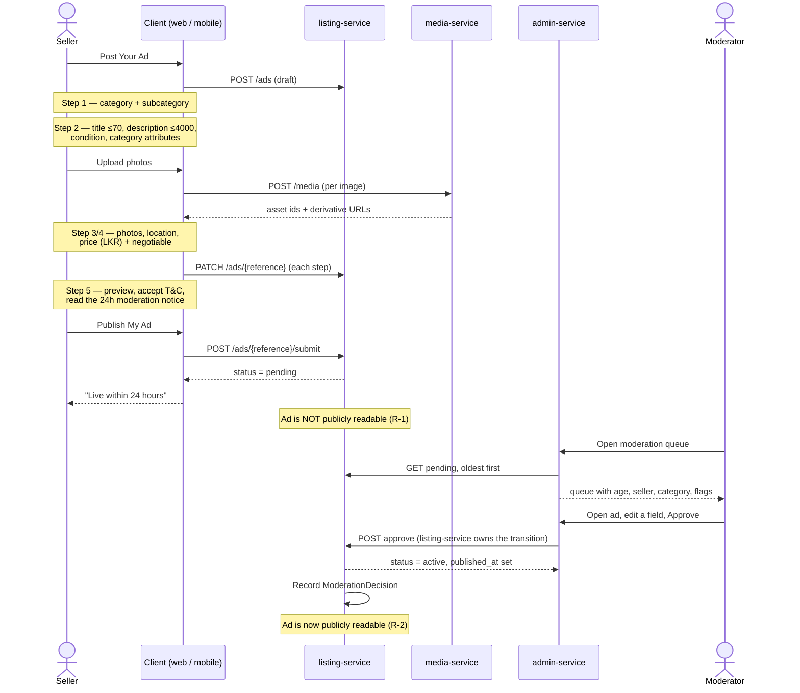

# Flow 01 — Seller: post an ad through to live

> The product's spine. Derived from `post_your_ad_*`, `my_account_*`, `review_ad_admin_desktop`.
> Requirements: FR-6…FR-15, FR-32…FR-33, R-1, R-2. Acceptance: AC-3, AC-4, AC-5, AC-6.

## Happy path

## Steps and rules

| # | Step | Rules and evidence |
|---|---|---|
| 1 | Seller starts the wizard | Requires a signed-in account with a verified email (FR-3, `[PROPOSED]`) |
| 2 | Category → subcategory | Nine locked top-level categories. Subcategory drives which attribute set step 2 renders |
| 3 | Details | Title required, **≤70 chars, live counter**; description required, **≤4000, live counter**; condition; category attributes from `GET /categories/{slug}/attributes` |
| 4 | Photos | Multi-image, ordered, one main. Native permission prompts on mobile. Limits undecided (OQ-12) |
| 5 | Location | Province → District → City, cascading |
| 6 | Price | LKR integer minor units + optional `Negotiable` |
| 7 | Preview + submit | Full buyer-view preview; T&C + Privacy acceptance is a **hard gate**; moderation notice shown; promotion offered as a **deferrable** upsell, never blocking |
| 8 | `PENDING` | Invisible on every public read path, on all three clients, including by direct URL. 404 not 403 (D-24). **This is AC-4** |
| 9 | Moderation | Oldest-first queue with age. Moderator may edit fields before approving |
| 10 | `ACTIVE` | Immediately findable by category, location, price and free-text; renders with its `LL-NNNNN` reference |

**`Save as Draft` is available at every step**, and `Save as Draft & Exit` from step 5 — so the wizard
must persist incrementally rather than only on final submit.

## Unresolved before this flow can be built

- **OQ-03** — the two Stitch steppers disagree on whether step 4 is `Preview` or `Price & Contact`, and
  both screens carry a pricing block. The wizard cannot be built against two contradictory designs.
- **OQ-04** — only the Vehicles attribute set is specified. Eight categories have none.
- **OQ-12** — photo count, size cap, formats.
- **OQ-34** — the create form offers two conditions (`Brand New`, `Used`); search offers three
  (adds `Reconditioned`).

## Rejection branch

Requires a rejection reason visible to the seller (R-3, AC-7) and a revise path. **No screen exists for
either** — design debt, item 23 in the asset inventory. Reason codes are undecided (OQ-13).
