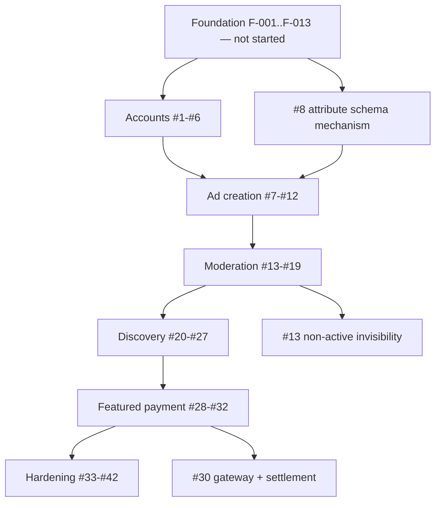

# LankaListings — Features

> Live index of all features in the engagement.
>
> **⚠️ This is a PRE-GATE-3 HAND SEED, not a decomposition.** `/forge-decompose` (Gate 3) regenerates this
> file with the agreed slicing principle, the final feature set, sizing, and the dependency graph. Until
> then these rows exist so early planning conversations have something concrete to point at. **Do not
> write specs against them, and do not treat the IDs as stable.**
>
> Gate 3 is additionally blocked on Gate 1 and Gate 2 — and on OQ-01, OQ-02 and OQ-20, without which no
> sizing is trustworthy.
>
> **Source-of-truth model:**
> - **This file** = human/agent-readable index. Easy to scan, link from conversation, and pick up at the start of a feature session.
> - **`tracker.yaml` `features:` block** = structured state. Drives gate logic and leadership visibility.
> - **Per-feature spec at `.forge/specs/<id>-<name>-spec.md`** = full description, requirements, acceptance criteria.
>
> These three must stay in sync. When a feature's phase or artifact status changes, update both this file and `tracker.yaml`. The PRD's §Feature Decomposition is a Gate-1-approved **snapshot** (frozen on Gate 1 approval) — do not edit it to reflect live state; reflect live state here instead.
>
> Foundation slices (`F-001`, `F-002`, …) live separately under `setup.foundation` in `tracker.yaml` — they are scaffolding, not user-visible features, and do not appear here.

## Slicing Principle

**Proposed for Gate 3 — not yet agreed:** *vertical slices by journey step, per milestone.* Each slice owns
its full stack — service endpoint, persistence, **every affected client**, and tests at the assigned tiers.
A slice that ships a backend endpoint with no client, or a UI over a fixture, is half a slice and hides
integration risk until later.

Rejected alternatives, recorded so a future re-slicing conversation has the prior reasoning:

- **By service** (all of `identity-service`, then all of `listing-service`, …) — rejected: nothing is
  demonstrable until the last service lands, and seam defects surface at the end instead of continuously.
- **By client** (all web, then mobile) — rejected: guarantees the mobile client falls permanently behind
  and violates SC-11.
- **By layer** (all schemas, then all APIs, then all UI) — rejected: the horizontal-slice trap. No
  user-visible progress for a long time and no early feedback.

Source: `.forge/discovery/docs/07-harness-backlog.md` (reconstructed 2026-08-24). **Not yet validated by
`/forge-decompose`.**

## Dependency Graph

**Critical path:** Foundation → Accounts → Ad creation → Moderation → Discovery → Featured payment. Each
stage is the precondition of the next; payment last is a correctness constraint, not a priority call.

**Parallel-eligible lanes:** operator administration (#33–#36) can run alongside Discovery once Moderation
lands. Design work for the ~11 undesigned surfaces should run **ahead** of its slice, not inside it.

**Three slices deserve individual attention:** **#8** (attribute schema mechanism) shapes four surfaces at
once and blocks ad creation; **#13** (non-`active` invisibility) is the product's core promise in code;
**#30** (gateway + settlement) is the only money path and is blocked on OQ-05.

## Features

Order is by critical-path priority. Phase is `backlog` for every row — nothing has a spec.

| ID | Title | Priority | Phase | Spec | Plan | Blocked By | Notes |
|----|-------|----------|-------|------|------|------------|-------|
| 1 | Email/password registration + verification | P0 | backlog | — | — | Foundation | SC-1. Verified email gates publishing |
| 2 | Google OAuth sign-in | P0 | backlog | — | — | Foundation | SC-2 |
| 3 | Account linking across both methods | P0 | backlog | — | — | #1, #2 | **Its own slice deliberately** — the branch that quietly ships broken and is expensive to unwind later |
| 4 | Password reset | P0 | backlog | — | — | #1 | Needs an email provider (OQ-29) |
| 5 | Profile + session across all three clients | P0 | backlog | — | — | #1 | Secure token storage on mobile |
| 6 | Operator roles + portal sign-in | P0 | backlog | — | — | #1 | Role enforced in-service, not only at the gateway. OQ-18 |
| 7 | Ad status machine + persistence | P0 | backlog | — | — | Foundation | Every transition tested valid **and** invalid; `LL-NNNNN` reference minted unique; soft delete. No UI |
| 8 | Category attribute schema mechanism | P0 | backlog | — | — | Foundation | **Blocks #9.** Drives create + detail + filters + admin taxonomy from one source. Spike first (OQ-30); only Vehicles is specified (OQ-04) |
| 9 | Post-ad wizard steps 1–2 | P0 | backlog | — | — | #7, #8 | Title ≤70, description ≤4000, condition, category attributes, draft save. **Blocked on OQ-03** — two contradictory stepper designs |
| 10 | Photo upload | P0 | backlog | — | — | Foundation | Multi-image, ordering, main photo, derivatives; native camera permissions on mobile. OQ-12 |
| 11 | Location capture | P0 | backlog | — | — | Foundation | Cascading Province → District → City |
| 12 | Wizard final step + submit | P0 | backlog | — | — | #9, #10, #11 | SC-3. Price + negotiable, preview, T&C gate, moderation notice, deferrable promotion upsell |
| 13 | Non-`active` invisibility | P0 | backlog | — | — | #7 | **SC-4. The single most important slice in the product.** Every public read path, all three clients, 404 not 403 |
| 14 | Moderation queue | P0 | backlog | — | — | #7, #6 | Oldest-first with age, seller, category, flags. OQ-16 for the flag rules |
| 15 | Review, approve, reject | P0 | backlog | — | — | #14 | SC-5, SC-7. Pre-approval field edits; append-only decision history. OQ-13 for reason codes. Conditional on OQ-02 for the extraction panel |
| 16 | Seller-visible rejection + revise | P0 | backlog | — | — | #15 | SC-7. **Needs design — no screen exists** |
| 17 | My Ads | P0 | backlog | — | — | #7 | SC-10. Status tabs, row actions, overview counters |
| 18 | Re-moderation on edit | P0 | backlog | — | — | #15, #17 | OQ-14 defines the moderated-field set |
| 19 | Bulk moderation actions | P1 | backlog | — | — | #15 | Slide-in bottom toolbar |
| 20 | Home | P0 | backlog | — | — | #13 | Real category counts + featured rail. Removes `frontend-web/src/lib/listings.ts` |
| 21 | `GET /ads` search core | P0 | backlog | — | — | #13 | Free-text, category, location, price, condition, sort, cursor pagination, `meta.total`. The busiest endpoint in the product |
| 22 | Filter rail | P0 | backlog | — | — | #21, #8 | All filters + category-specific block + verified-sellers-only; chips; Clear All; keyboard operable |
| 23 | Results presentation | P0 | backlog | — | — | #21 | Grid/list toggle, count, ad card, skeleton loaders |
| 24 | Ad detail | P0 | backlog | — | — | #13, #8 | SC-6. Gallery, attribute-driven spec table, `LL-` reference, seller contact. OQ-10 on contact visibility |
| 25 | Favourites | P1 | backlog | — | — | #24 | Save/unsave from card + detail; Saved Ads list. **Saved Ads needs design** |
| 26 | Ad metrics | P1 | backlog | — | — | #24 | Views + inquiries. OQ-19 defines a view. **If messaging is deferred (OQ-01), the inquiry counter needs a definition or removal** |
| 27 | Report an ad | P1 | backlog | — | — | #24, #14 | Closes the loop on an operator queue that currently has no input. **Needs design.** OQ-15 |
| 28 | Promotion plan catalogue + admin | P0 | backlog | — | — | #6 | OQ-06 — no plans exist yet |
| 29 | Featuring purchase initiation | P0 | backlog | — | — | #28, #13 | SC-9. `active` + owned only, else 409 |
| 30 | Gateway integration + settlement | P0 | backlog | — | — | #29 | SC-8, SC-15. **Blocked on OQ-05 — no gateway chosen.** Idempotent webhook; window starts on settlement only |
| 31 | Featured ranking + expiry | P0 | backlog | — | — | #30, #21 | Server-side featured-first ordering. OQ-11 for the interleave |
| 32 | Purchase history + reconciliation | P1 | backlog | — | — | #30 | Guards the worst failure mode: paid but not featured |
| 33 | Admin dashboard | P1 | backlog | — | — | #6 | SC-12. KPIs + by-category + by-province, reconciled against source data |
| 34 | Advertisements register | P1 | backlog | — | — | #6, #7 | Filters, flagged count, CSV export, operator ad creation |
| 35 | User administration | P1 | backlog | — | — | #6 | **Needs design.** OQ-18 |
| 36 | Taxonomy administration | P1 | backlog | — | — | #8 | **Needs design.** Categories + attribute schemas |
| 37 | Accessibility pass | P1 | backlog | — | — | #24, #33 | SC-13. Automated scan in CI |
| 38 | Security pass | P1 | backlog | — | — | #30 | SC-14. Authz matrix per role, secrets audit, rate limiting |
| 39 | Performance pass | P1 | backlog | — | — | #21 | Measured at planning volumes; index plan validated; CDN for imagery |
| 40 | Ad expiry job | P1 | backlog | — | — | #7 | Blocked on OQ-07 — no duration decided |
| 41 | Reports + settings | P2 | backlog | — | — | #33 | Blocked on OQ-17 — contents undefined |
| 42 | Empty / loading / error states | P1 | backlog | — | — | #23, #33 | Every surface, all three clients. **Needs design** |

### Not listed — blocked on a scope decision

| Capability | Blocked on |
|---|---|
| In-app messaging / inquiry threads (potentially its own milestone) | **OQ-01** |
| AI/OCR ad intake + extraction review | **OQ-02** |

## Legend

- **Phase:** `backlog` → `spec` → `plan` → `dev` → `review` → `ship` → `done`. Exit states from any phase: `paused`, `dropped`.
- **Priority:** **P0** = foundational + critical path · **P1** = core business value · **P2** = supporting / enhancement.
- **Spec / Plan columns:** link to `.forge/specs/<id>-<name>-spec.md` and `.forge/plans/<id>-<name>-plan.md`. Spec stubs are created by `/forge-decompose` full mode; plans land per-feature once each spec is approved.

## Cross-references

- **PRD §Scope and Boundaries → In Scope (V1)** — the nine scope rows (S-1…S-9) these features implement.
  Frozen on Gate 1 approval; this file is the live mirror.
- **`.forge/discovery/docs/07-harness-backlog.md`** — the origin of these rows, with a definition of done
  per slice and the sizing caveats.
- **`tracker.yaml` `features:`** — structured-state mirror. Currently **empty**; populated at Gate 3.
- **`engagement-gate-runs.md` → Gate 3** — will hold the audit of the decomposition pass.

## Cross-cutting NFRs (acceptance gates, not features)

These apply to **every** feature and are verified at PR review or per-feature acceptance. Spec authors
reference this list rather than re-deriving it per feature.

| NFR | Source | Owner |
|---|---|---|
| **Non-`active` invisibility** — no public read path ever returns a non-`active` ad; hidden ads 404, never 403 | PRD §Domain Model, SC-4 | Every spec touching a read path — assert per route in acceptance criteria |
| **Ownership scoping** — every seller mutation and every featuring purchase is owner-verified server-side | PRD §Users and Access | Every spec with a seller mutation |
| **Role enforcement in-service**, not only at the gateway | PRD §Users and Access | Every operator-facing spec |
| **Mobile parity** — every user-facing slice ships web + mobile; completable at a 375px viewport | PRD SC-11 | Every user-facing spec |
| **WCAG 2.1 AA** — semantic landmarks, keyboard operability, visible focus, contrast; automated scan per page visited | PRD §NFR > Accessibility, SC-13 | Every UI-bearing spec |
| **Money discipline** — integer LKR minor units end to end; no float in any service or client; `Rs. n,nnn` formatting with separators | PRD §NFR > Security, D-21 | Every spec touching price |
| **API conventions** — one envelope, stable `error.code`, lower-snake_case enums, RFC 3339 UTC, cursor pagination on public collections. Framework defaults lose | `.forge/discovery/docs/05-api-contract.md` | Every spec adding an endpoint |
| **Observability** — structured logs at the right level, correlation id propagated, **no PII in log output** | PRD §NFR > Observability | Every spec |
| **Copy externalisation** — user-facing strings externalised from day one, since Sinhala and Tamil are named future work | PRD §NFR, D-07 | Every UI-bearing spec |
| **Fixture removal** — a slice that replaces a hard-coded fixture removes it | `.forge/discovery/docs/02-ux-scope.md` §7 | #20, #33, and any slice touching a seeded surface |
| **Dependency-vulnerability gate** green at the chosen CVSS threshold | PRD §NFR > Security, OQ-33 | Every spec — confirmed, not re-decided |
